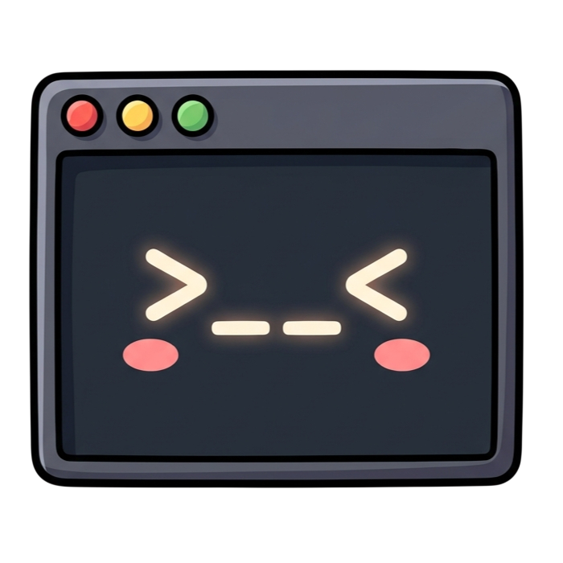

# Kimbo

A fast, themeable terminal emulator built with Rust and Tauri. Multi-pane layouts, tabbed windows, and a project launcher for developer workflows.



> **Beta** — Kimbo is in active development. Expect rough edges. Feedback and contributions welcome.

## Features

- **Multi-pane layouts** — split vertically (Cmd+D) or horizontally (Cmd+Shift+D), nest arbitrarily
- **Tabbed windows** — each tab has its own independent pane layout
- **Project launcher** — scans your project directories, jump to any project with Cmd+O
- **Themeable** — JSON themes (VS Code format), 3 built-in + community theme repo
- **True color (24-bit)** — full color support for modern CLI tools
- **Settings UI** — built-in settings panel (Cmd+,) for theme, font, keybindings, workspaces
- **Configurable keybindings** — all shortcuts customizable via settings or config file
- **Clickable URLs** — Cmd+click to open links in your browser
- **Native macOS menu bar** — standard app menu with all actions

## Tech Stack

- **Rust** — PTY management, config, workspace detection
- **Tauri 2** — native app shell, IPC between Rust and frontend
- **xterm.js** — terminal emulation and rendering
- **TypeScript** — frontend UI (vanilla, no framework)

## Installation

### Build from Source

Requires: [Rust](https://rustup.rs/), [Node.js](https://nodejs.org/) (v18+), [Tauri CLI](https://tauri.app/)

```bash
git clone https://github.com/lucatescari/kimbo-terminal.git
cd kimbo-terminal
npm install
cargo install tauri-cli --version "^2"
```

**Development:**
```bash
npm start
```

**Production build (signed .app + .dmg on macOS):**
```bash
npm run build
```

The built app is at `target/release/bundle/macos/Kimbo.app`.

### Download

macOS builds will be available on the [Releases](https://github.com/lucatescari/kimbo-terminal/releases) page soon.

## Configuration

Config file: `~/.config/kimbo/config.toml`

```toml
[general]
default_shell = "/bin/zsh"

[font]
family = "JetBrains Mono"
size = 14.0
line_height = 1.2
ligatures = true

[theme]
name = "kimbo-dark"

[scrollback]
lines = 10000

[cursor]
style = "block"
blink = true

[workspace]
auto_detect = true
scan_dirs = ["~/Projects"]
```

Or use the built-in settings UI (Cmd+,).

## Keybindings

| Shortcut | Action |
|---|---|
| Cmd+T | New tab |
| Cmd+Shift+W | Close tab |
| Cmd+D | Split vertically |
| Cmd+Shift+D | Split horizontally |
| Cmd+W | Close pane |
| Cmd+Arrow | Navigate between panes |
| Cmd+] / Cmd+[ | Next / previous tab |
| Cmd+1-9 | Switch to tab by number |
| Cmd+O | Project launcher |
| Cmd+, | Settings |
| Cmd+Q | Quit |

All keybindings are customizable in Settings > Keybindings.

## Themes

Kimbo uses JSON themes in VS Code format. Three built-in themes are included:

- **Kimbo Dark** — default dark theme
- **Catppuccin Mocha** — warm dark pastels
- **Catppuccin Latte** — warm light pastels

Community themes are available in Settings > Appearance. You can also create your own — see the [kimbo-themes](https://github.com/lucatescari/kimbo-themes) repo for the format and how to contribute.

Install custom themes by placing `.json` files in `~/.config/kimbo/themes/`.

## Scripts

| Command | Description |
|---|---|
| `npm start` | Run in development mode |
| `npm run build` | Production build (.app + .dmg) |
| `npm test` | Run frontend tests |
| `npm run test:rust` | Run Rust tests |
| `npm run test:all` | Run all tests |

## Project Structure

```
kimbo-terminal/
  src-tauri/          # Rust backend (Tauri app, PTY management, commands)
  src-ui/             # TypeScript frontend (xterm.js, tabs, settings, etc.)
  crates/
    kimbo-terminal/   # Raw PTY wrapper (spawn, read/write, resize, CWD)
    kimbo-config/     # Config loading, JSON themes, keybinding definitions
    kimbo-workspace/  # Project detection and directory scanning
```

## Platform Support

- **macOS** — primary platform, fully supported
- **Linux** — planned
- **Windows** — planned

## Contributing

See [CONTRIBUTING.md](CONTRIBUTING.md) for guidelines.

## License

[MIT](LICENSE)
