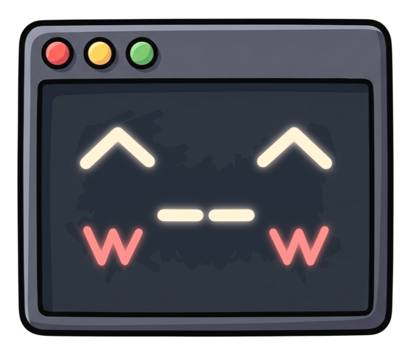
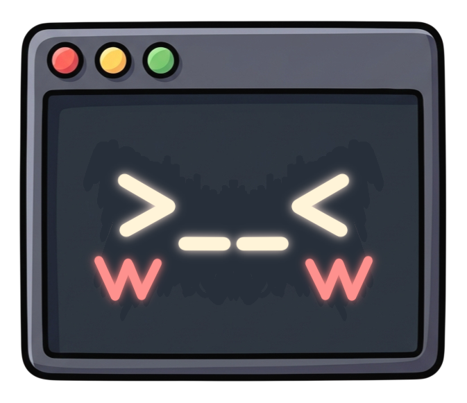
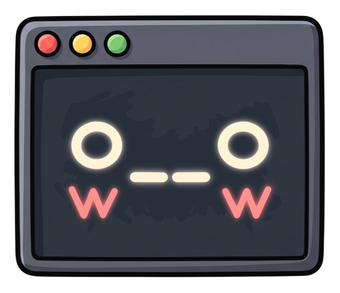

# Kimbo

A fast, themeable terminal emulator built with Rust and Tauri. Multi-pane layouts, tabbed windows, and a command palette for developer workflows.

<p align="center">
  <a href="https://github.com/lucatescari/kimbo-terminal/actions/workflows/ci.yml"></a>
  <a href="https://github.com/lucatescari/kimbo-terminal/releases/latest"></a>
  <a href="LICENSE"></a>
  
  
</p>

<p align="center">
  
  
  
</p>

> **Beta** — Kimbo is in active development. Expect rough edges. Feedback and contributions welcome.

<p align="center">
  
</p>

## Features

- **Multi-pane layouts** — split vertically (Cmd+D) or horizontally (Cmd+Shift+D), nest arbitrarily
- **Tabbed windows** — each tab has its own independent pane layout, drag-and-drop to reorder
- **Command palette** — unified launcher for commands and projects (Cmd+K)
- **Find in scrollback** — search terminal output with regex and case-sensitive modes (Cmd+F)
- **Themeable** — JSON themes (VS Code format), 2 built-in (Kimbo Dark / Light) + one-click install from the community theme repo
- **Inline images** — renders iTerm2-style OSC 1337 images directly in the terminal (works with `imgcat`, `fastfetch`)
- **Claude Code HUD** — per-pane detection of Claude Code showing the logged-in account email, model, and session id alongside a rate-limit status line (5h / 7d windows + reset times)
- **True color (24-bit)** — full color support for modern CLI tools
- **Settings UI** — built-in settings panel (Cmd+,) for theme, font, keybindings, workspaces
- **Configurable keybindings** — all shortcuts customizable via settings or config file
- **Session restore** — tabs and working directories persist across app restarts
- **Clickable URLs** — Cmd+click to open links in your browser
- **Window opacity** — adjustable window transparency
- **Quit confirmation** — optional prompt before closing active panes
- **Drag and drop** — drop files and folders directly into the terminal
- **Welcome screen** — keyboard shortcut intro for first-time users
- **Native macOS menu bar** — standard app menu with all actions

<p align="center">
  
</p>

### `imgcat`

Kimbo's shell init scripts (`kimbo-init.zsh` / `.bash` / `.fish`) define an `imgcat` function that emits the OSC 1337 sequence Kimbo renders. Once you've sourced the init script in your shell rc, it just works:

```bash
imgcat /path/to/image.png
```

The function is skipped if you already have an `imgcat` binary on `PATH` (e.g. iTerm2's bundled one), so it never shadows a richer impl. Kimbo also supports the multipart variant emitted by iTerm2's `imgcat` and by `fastfetch`.

### Screen Pets

Optional animated companions that roam the window (Settings → Pets). Sprite art
is from [VS Code Pets](https://github.com/tonybaloney/vscode-pets) by Anthony
Shaw, used under the MIT License — see `src-ui/public/pets/VSCODE-PETS-LICENSE`.
Some individual sprites carry their own per-asset licenses included alongside
them (for example `src-ui/public/pets/dog/license.txt` is CC BY-ND 4.0), and
Kimbo ships the sprites unmodified.

## Tech Stack

- **Rust** — PTY management, config, workspace detection
- **Tauri 2** — native app shell, IPC between Rust and frontend
- **xterm.js** — terminal emulation and rendering
- **TypeScript** — frontend UI (vanilla, no framework)

## Installation

### Build from Source

Requires: [Rust](https://rustup.rs/), [Node.js](https://nodejs.org/) (v18+), [Tauri CLI](https://tauri.app/)

```bash
git clone https://github.com/lucatescari/kimbo-terminal.git
cd kimbo-terminal
npm install
cargo install tauri-cli --version "^2"
```

**Development:**
```bash
npm start
```

**Production build (signed .app + .dmg on macOS):**
```bash
npm run build
```

The built app is at `target/release/bundle/macos/Kimbo.app`.

### Download

Signed macOS builds (`.dmg` and `.app.tar.gz`, Apple Silicon) are available on the [Releases](https://github.com/lucatescari/kimbo-terminal/releases) page. Kimbo also self-updates via the in-app updater.

## System Requirements

- macOS 13 (Ventura) or later, Apple Silicon or Intel.

### Building from source

- Rust (stable) and Node.js 20+.

## Configuration

Config file: `~/.config/kimbo/config.toml`

```toml
[general]
default_shell = "/bin/zsh"

[font]
family = "JetBrains Mono"
size = 14.0
line_height = 1.2
ligatures = true

[theme]
name = "kimbo-dark"

[scrollback]
lines = 10000

[cursor]
style = "block"
blink = true

[workspace]
auto_detect = true
scan_dirs = ["~/Projects"]
```

Or use the built-in settings UI (Cmd+,).

## Keybindings

| Shortcut | Action |
|---|---|
| Cmd+K | Command palette |
| Cmd+T | New tab |
| Cmd+Shift+W | Close tab |
| Cmd+D | Split vertically |
| Cmd+Shift+D | Split horizontally |
| Cmd+W | Close pane |
| Cmd+Arrow | Navigate between panes |
| Cmd+] / Cmd+[ | Next / previous tab |
| Cmd+1-9 | Switch to tab by number |
| Cmd+F | Find in scrollback |
| Cmd+, | Settings |
| Cmd+Q | Quit |

All keybindings are customizable in Settings > Keybindings.

## Themes

Kimbo uses JSON themes in VS Code format. Two built-in themes ship with the app:

- **Kimbo Dark** — default dark theme
- **Kimbo Light** — default light theme

More themes (including Catppuccin Mocha and Latte) install with one click from **Settings → Appearance**. You can also create your own — see [`docs/themes.md`](docs/themes.md) for the schema and the [kimbo-themes](https://github.com/lucatescari/kimbo-themes) repo for community submissions.

Manual install: drop `.json` files in `~/.config/kimbo/themes/`.

## Scripts

| Command | Description |
|---|---|
| `npm start` | Run in development mode |
| `npm run build` | Production build (.app + .dmg) |
| `npm test` | Run frontend tests |
| `npm run test:rust` | Run Rust tests |
| `npm run test:all` | Run all tests |

## Project Structure

```
kimbo-terminal/
  src-tauri/          # Rust backend (Tauri app, PTY management, commands)
  src-ui/             # TypeScript frontend (xterm.js, tabs, settings, etc.)
  crates/
    kimbo-terminal/            # Raw PTY wrapper (spawn, read/write, resize, CWD)
    kimbo-config/              # Config loading, JSON themes, keybinding definitions
    kimbo-workspace/           # Project detection and directory scanning
    kimbo-claude-statusline/   # Claude Code rate-limit status line (5h / 7d + reset time)
    kimbo-claude-notify/       # Claude Code per-pane notifications
```

## Platform Support

- **macOS 13 (Ventura) or later** — fully supported (Apple Silicon and Intel)
- **Linux** — planned

## Contributing

See [CONTRIBUTING.md](CONTRIBUTING.md) for guidelines.

## License

[MIT](LICENSE)
